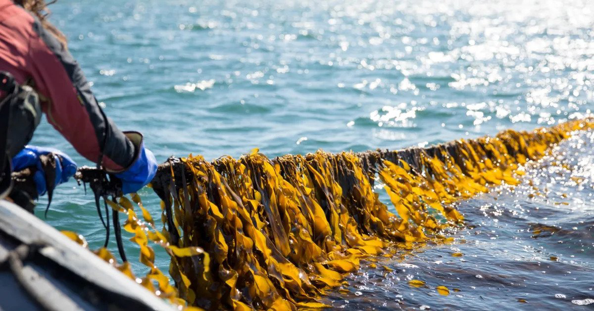

# Why did the lobster blush?
###### Because the sugar kelp.

---

Welcome to Team 1's GitHub for the AI Challenge!

---

## Getting started

**Step 1**: Grab [Git] tools(https://git-scm.com/book/en/v2/Getting-Started-Installing-Git).

**Step 2**: Clone our repo:

`git clone https://github.com/scottwellington/AIChallenge.git`

## Notes for Team Members: making changes to this repo

Note: this is the most straight-forward and accessible way to use GitHub as a team, but this isn't how you'd typically use it: we are going to simplify the process by avoiding branches, rebase and merge, which are not newbie-friendly.

However, this requires some due diligence that you always pull the latest version before pushing any changes. Important enough to be worth repeating: *Do not push changes to the repo without first pulling the most recent version!*

Navigate to the repo (default `~/AIChallenge`)

**Step 1**: Pull the most recent version of the repo:

`git pull`

**Step 2**: Update list of md5 checksums:

`git add --all`

**Step 3**: Commit changes to your local repo, with a useful update description:

`git commit -m 'added new script for data cleaning'`

**Step 4**: Push changes to the remote repo:

`git push`

Done :-)

---

###### TODO

* 07/05/21 - go to the pub and celebrate a job well done [Scott]
